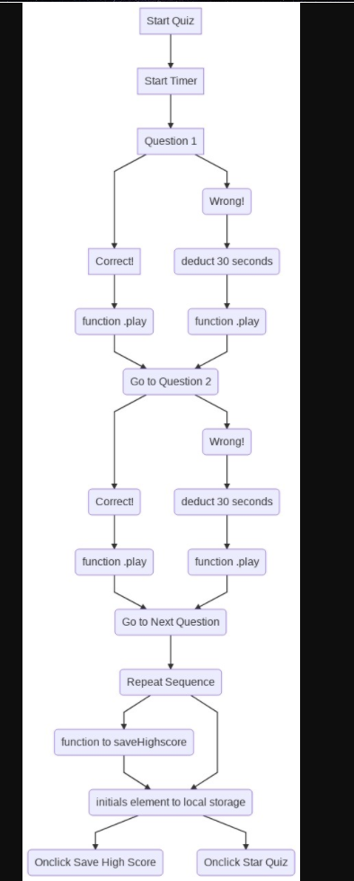

# Code Quiz
- [Demo](#Demo)
- [Code-Quiz](#Coding-Quiz)
- [Diagram](#Diagram)
- [End](#End)


# Demo

* Quiz In Action
- [https://drive.google.com/file/d/1nfTT2Hxz6PvkoXAdkv7pNkCsY4fz8roX/view]; ![demo of quiz application]

# Diagram


https://mermaid.ink/img/eyJjb2RlIjoiZ3JhcGggVERcbiAgICBBW1N0YXJ0IFF1aXpdIC0tPiBCKFN0YXJ0IFRpbWVyKVxuICAgIEJbU3RhcnQgVGltZXJdIC0tPiBDKFF1ZXN0aW9uIDEpLS0-IEQoQ29ycmVjdCEpXG4gICAgQ1tRdWVzdGlvbiAxXS0tPiBFKFdyb25nISktLT4gRihkZWR1Y3QgMzAgc2Vjb25kcylcbiAgICBEW0NvcnJlY3QhXS0tPiBNKGZ1bmN0aW9uIC5wbGF5KSAtLT5HKEdvIHRvIFF1ZXN0aW9uIDIpXG4gICAgRihkZWR1Y3QgMzAgc2Vjb25kcyktLT5MKGZ1bmN0aW9uIC5wbGF5KS0tPkdcbiAgICBHLS0-SChDb3JyZWN0ISktLT5KKGZ1bmN0aW9uIC5wbGF5KVxuICAgIEctLT5JKFdyb25nISktLT4gSyhkZWR1Y3QgMzAgc2Vjb25kcyktLT5OKGZ1bmN0aW9uIC5wbGF5KSBcbiAgICBKLS0-TyhHbyB0byBOZXh0IFF1ZXN0aW9uKVxuICAgIE4tLT5PKEdvIHRvIE5leHQgUXVlc3Rpb24pLS0-UChSZXBlYXQgU2VxdWVuY2UpXG4gICAgUC0tPlEoZnVuY3Rpb24gdG8gc2F2ZUhpZ2hzY29yZSktLT5SKHNldG8gdG8gZW1wdHkgYXJyYXkgaWYgbm9uZSlcbiAgICBQLS0-Uihpbml0aWFscyBlbGVtZW50IHRvIGxvY2FsIHN0b3JhZ2UpXG4gICAgUi0tPlMoT25jbGljayBTYXZlIEhpZ2ggU2NvcmUpXG4gICAgUi0tPlQoT25jbGljayBTdGFyIFF1aXopXG4gICAgXG5cbiAgICAiLCJtZXJtYWlkIjp7InRoZW1lIjoiZGVmYXVsdCJ9LCJ1cGRhdGVFZGl0b3IiOmZhbHNlfQ

<!-- # 04 Web APIs: Code Quiz

As you proceed in your career as a web developer, you will probably be asked to complete a coding assessment, which is typically a combination of multiple-choice questions and interactive challenges. Build a timed code quiz with multiple-choice questions. This app will run in the browser and feature dynamically updated HTML and CSS powered by your JavaScript code. It will also feature a clean and polished user interface and be responsive, ensuring that it adapts to multiple screen sizes.

## User Story

```
AS A coding bootcamp student
I WANT to take a timed quiz on JavaScript fundamentals that stores high scores
SO THAT I can gauge my progress compared to my peers
```

## Acceptance Criteria

```
GIVEN I am taking a code quiz
WHEN I click the start button
THEN a timer starts and I am presented with a question
WHEN I answer a question
THEN I am presented with another question
WHEN I answer a question incorrectly
THEN time is subtracted from the clock
WHEN all questions are answered or the timer reaches 0
THEN the game is over
WHEN the game is over
THEN I can save my initials and score
```

The following animation demonstrates the application functionality:


### Review

You are required to submit the following for review:

* The URL of the functional, deployed application.

* The URL of the GitHub repository. Give the repository a unique name and include a README describing the project. -->